## 도서관리 어플리케이션
#### 회원 CRUD기능과 도서 CRUD기능, 도서 대출,반납기능 제공해주는 웹 어플리케이션 입니다.
#### 통계기능
#### - 등록된 분야별 등록된 도서 권수 조회기능
#### - 전체 회원의 대출 현황 조회기능   
 

## Tech Stack
#### BackEnd : kotlin, springBoot, jpa, Querydsl
#### FrontEnd : react, typeScript
#### database : H2
#### buid : gradle
#### tset : junit5
 

## Team
#### 벡엔드 개발자 1명 / kimsaungan 
#### 프론트 개발자 1명 / aesop0817
 

## Part
#### - koltin, springBoot 벡엔드 서버 개발 
#### - 기획 및 리펙토링
 
 

## Learned
#### - java 코드를 kotlin 코드로 리펙토링하면서, 생성자, null처리방식을 통해 간결성과 안정성을 이해할 수 있었습니다.
#### - junit5 TEST코드를 사전에 작성하고 기능 레펙토링과 kotlin코드 변환을 진행해봄으로써 TEST코드의 개발 효율을 향상시킬 수 있었습니다.
#### - 책 분야, 반납 여부를 enum class로 리펙토링함으로써 재사용성을 높이는 고민을 해볼 수 있었습니다.
#### - fetch join을 통해 n+1문제를 해결해봄으로써, 서버과부하 관점에서 벡엔드 코드와 Query로 변환되는 과정을 함께 고민하며 개발을 진행할 수 있었습니다.
#### - 기존의 jpql코드를 querydsl로 리펙토링하므로써 컴파일 단계에서의 타입안전성, 직관적인 동적쿼리를 통해 유지보수를 높일 수 있었습니다.
 

## Screenshot
### 등록페이지
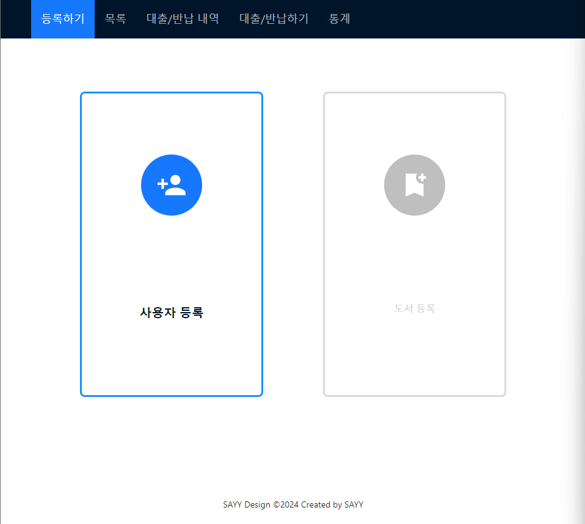</img>
 

 <h3>회원 등록</h3>
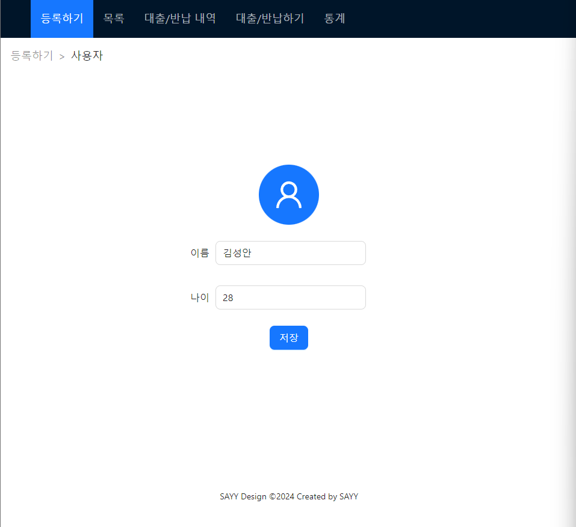</img>
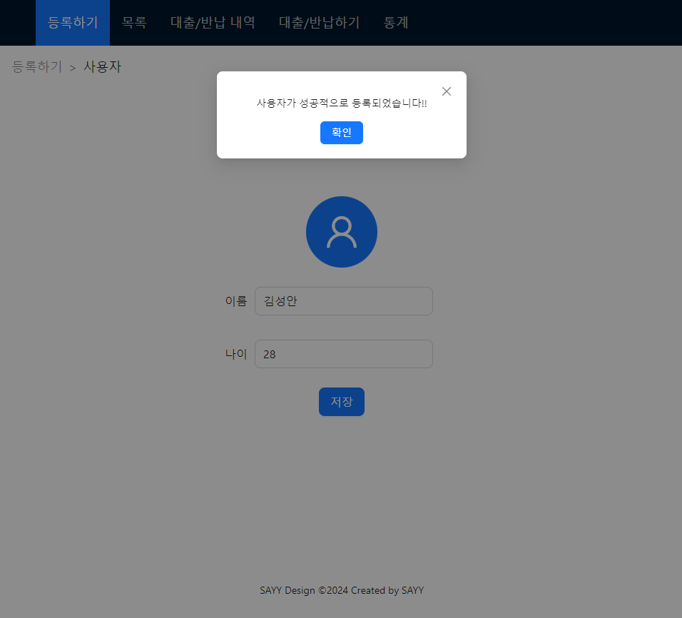</img>

 

 
### 회원 조회

</img>

 

### 회원 수정

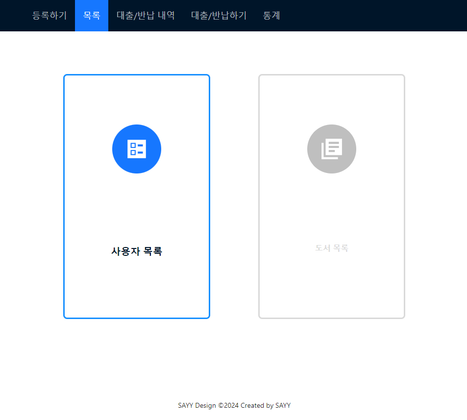
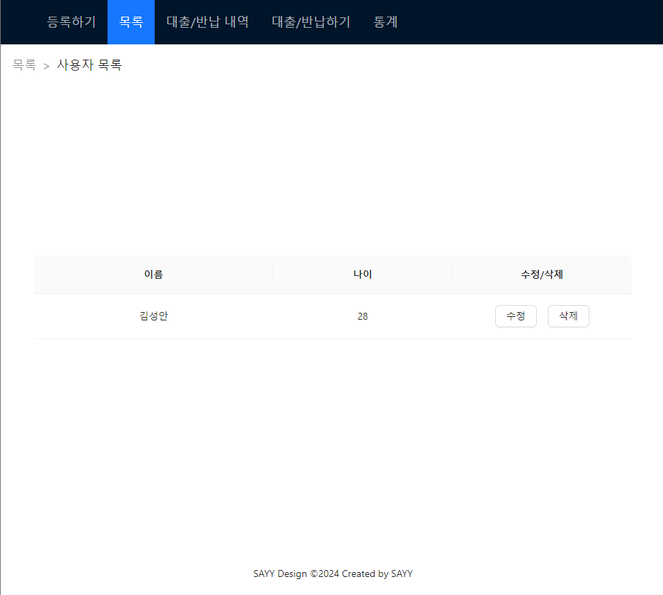</img>

 

### 회원 삭제

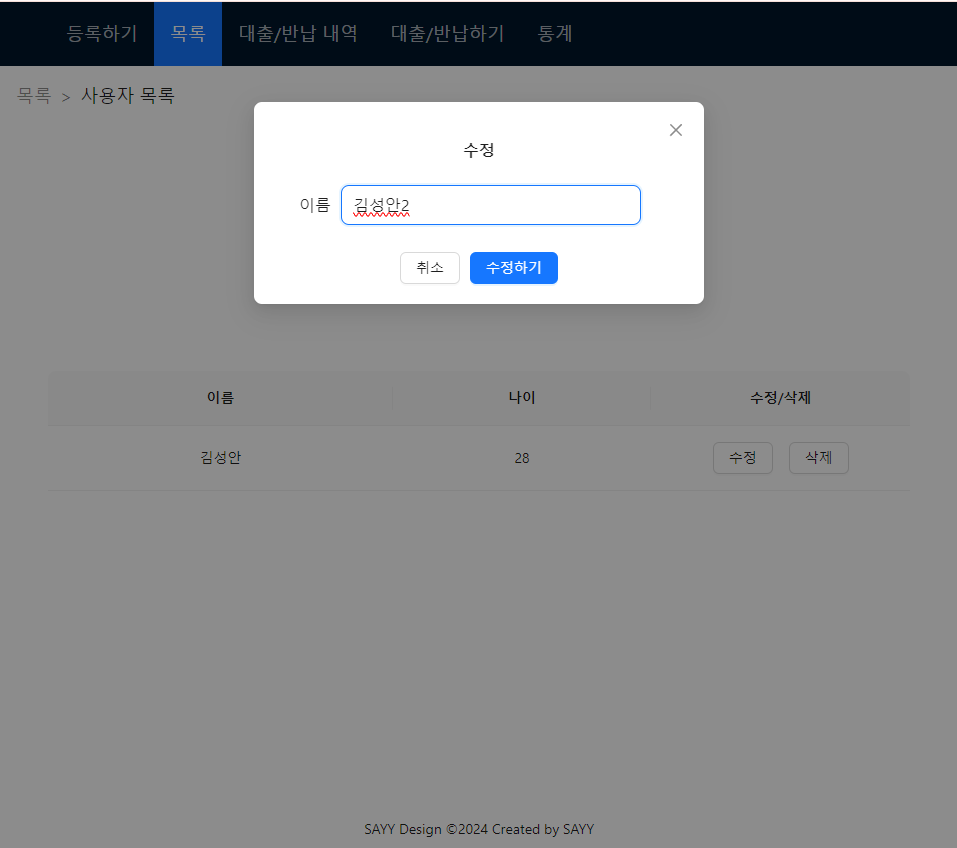
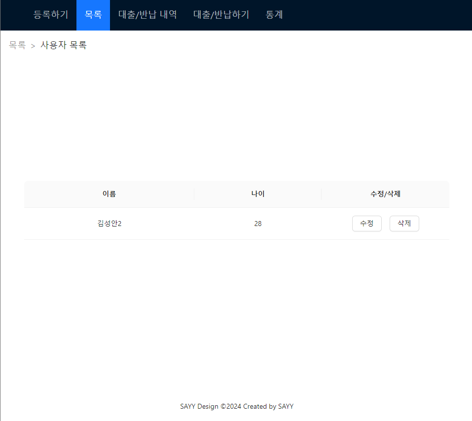</img>

 

### 도서 대출

</img>

 

### 도서 반납

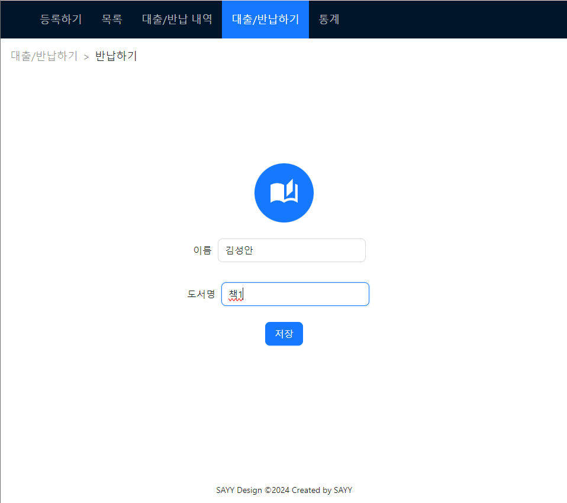
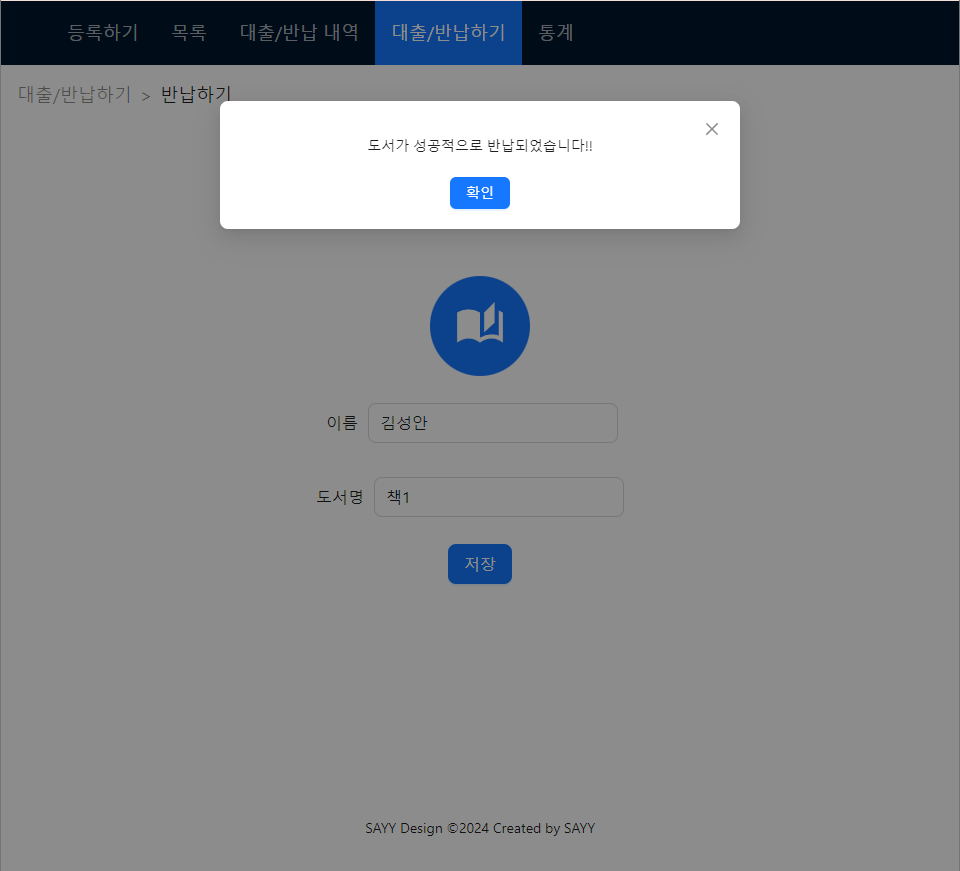</img>

 

### 통계

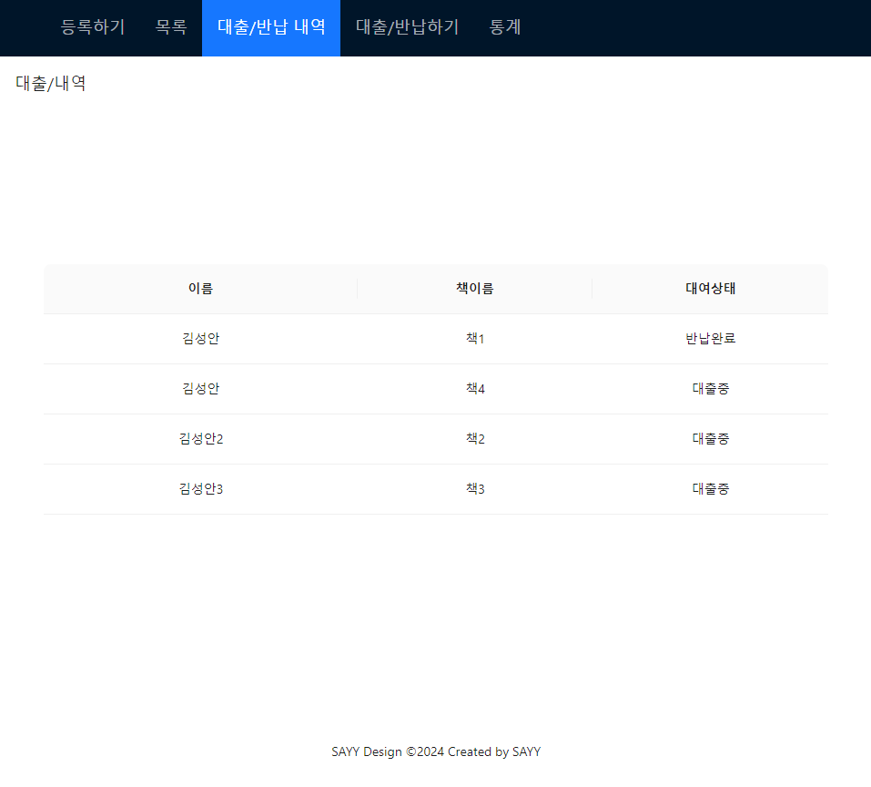
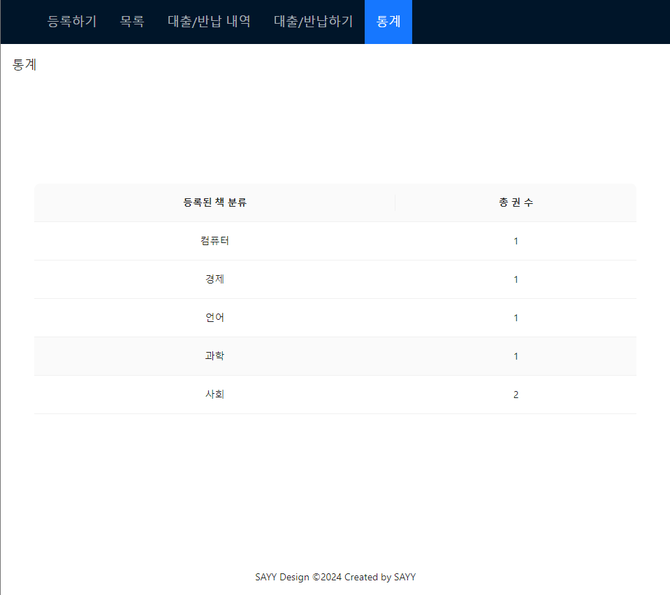</img>

 

